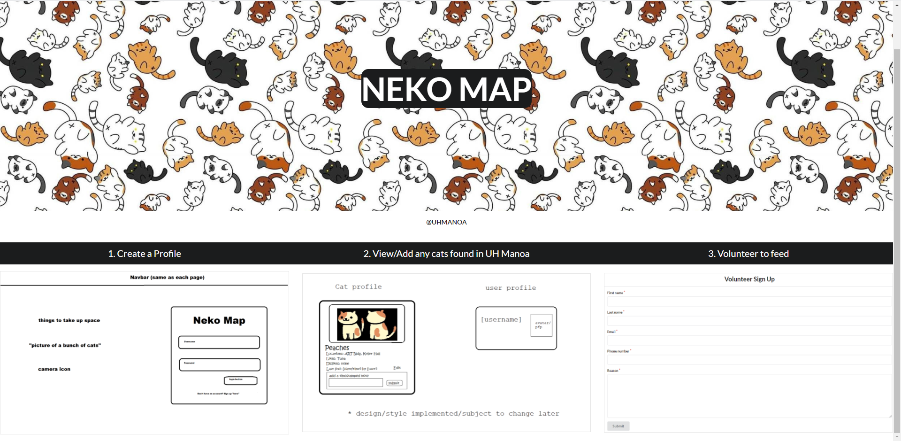
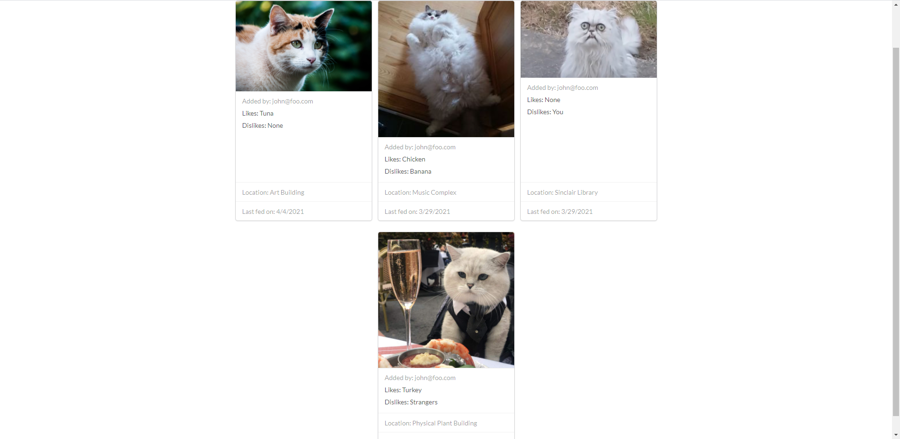
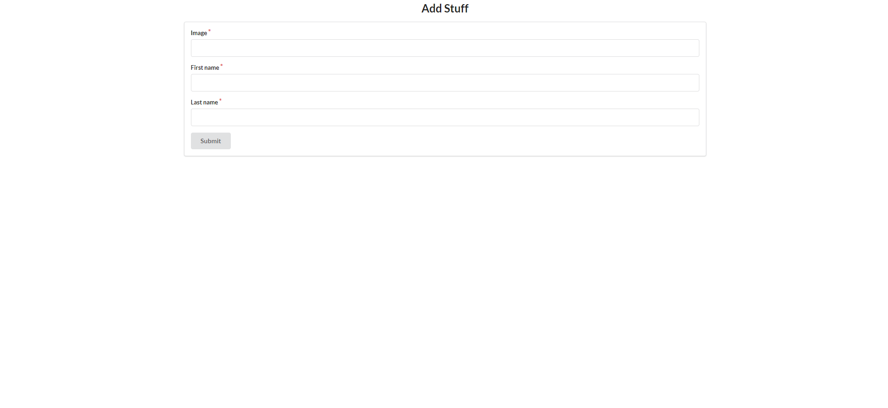
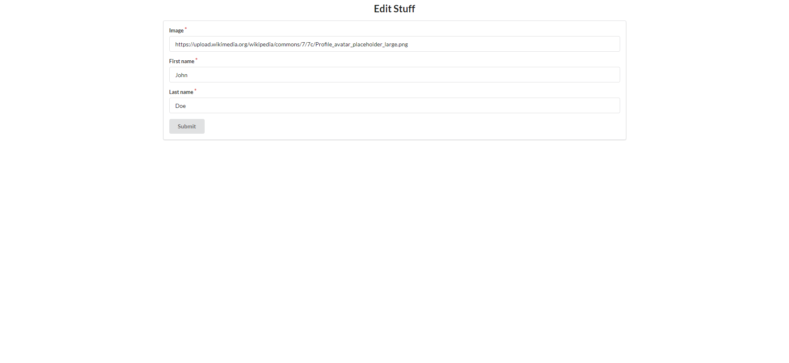
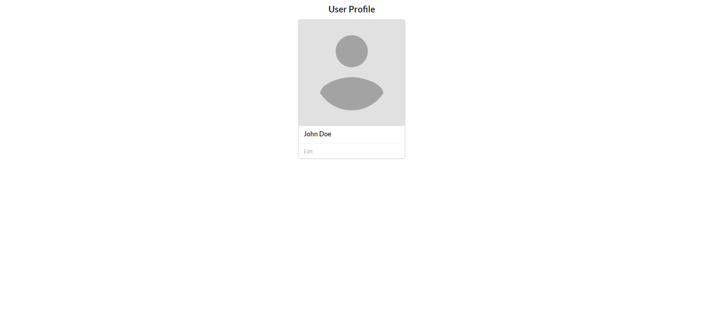
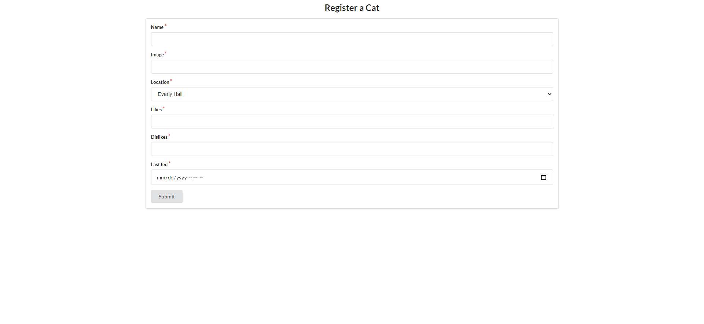
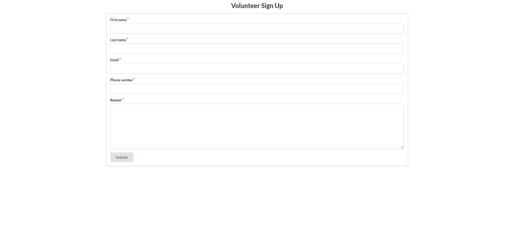
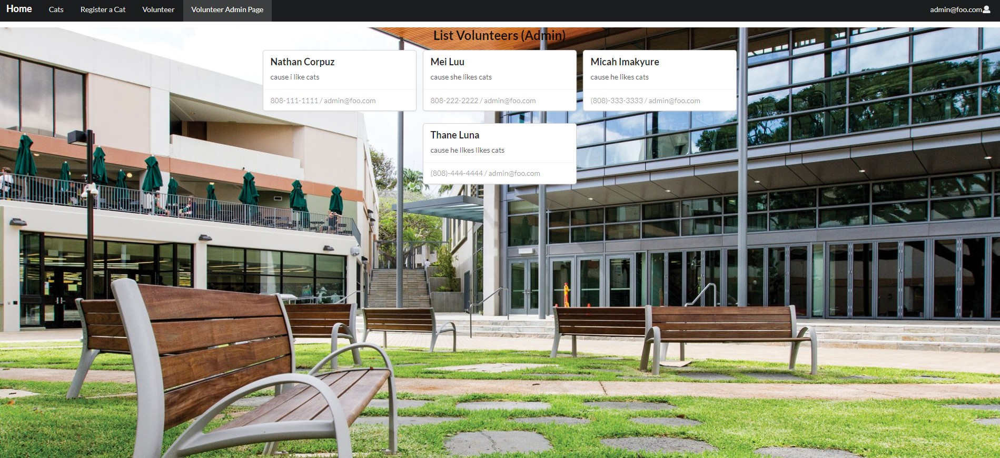

## Table of contents

* [Overview](#overview)
* [User Guide](#User-Guide)
* [Deployment](#deployment)
* [Developers Guide](#Developers-Guide)

## Overview

Neko Map is an application that allows students share, track, and create profiles for stray cats on campus. Students can upload any information known about the cats they find and collaborate with other users to take care of them. The application will also implment various features to such as: 

* Cat name, gender, pictures, age, location
* Illnesses
* Feeding volunteers
* Adoption/vet pickup
* Kittens notification
* Map-based location guide
* Reports on population, illnesses, feedings, etc.
* Emergency notification info

## Community Feedback

1st Participant - Said that it was a good website, but also noted that there was a bug where the volunteer form when not logged in, will still ask you to log in. Also suggested that to upload an image it is weird to have to paste a link.
## User-Guide

This section provides a walkthrough of the Neko Map user interface and its capabilities.

### Landing Page

The landing page is presented to users when they visit the top-level URL to the site.



### Stray Cats page

Neko Map provides a public pages that present currently registered stray cats.

The Stray Cats page shows all of the currently registered stray cats and their associated Profiles:



### Sign in and sign up

Click on the "Login" button in the upper right corner of the navbar, then select "Sign in" to go to the following page and login. You must have been previously registered with the system to use this option:


Alternatively, you can select "Sign up" and register as a new user.


### Home page

After logging in, you are taken to the home page, which presents a form where you can complete and/or update your personal profile:





### Register New Stray page

Once you are logged in, you can petition for a new cat profile through the Register New Stray page:




### Volunteer page

If you would like to care of a stray you can sign up to on the Volunteer page:



### Volunteer Admin Page

Page for admins to be able to contact any users who filled out the volunteer form.




## Deployment

[Website Link](https://neko-map.xyz/#/)

[M1 Project Board](https://github.com/neko-map/neko-map/projects/2)

[M2 Project Board](https://github.com/neko-map/neko-map/projects/3)

[M3 Project Board](https://github.com/neko-map/neko-map/projects/4)

# Developers-Guide

## Installation

First, [install Meteor](https://www.meteor.com/install).

Second, go to [https://github.com/ics-software-engineering/meteor-application-template-react](https://github.com/neko-map/neko-map-app), and click the "Use this template" button. Complete the dialog box to create a new repository that you own that is initialized with this template's files.

Third, go to your newly created repository, and click the "Clone or download" button to download your new GitHub repo to your local file system.  Using [GitHub Desktop](https://desktop.github.com/) is a great choice if you use MacOS or Windows.

Fourth, cd into the app/ directory of your local copy of the repo, and install third party libraries with:

```
$ meteor npm install
```

## Running the system

Once the libraries are installed, you can run the application by invoking the "start" script in the [package.json file](https://github.com/ics-software-engineering/meteor-application-template-react/blob/master/app/package.json):

```
$ meteor npm run start
```

The first time you run the app, it will create some default users and data. Here is the output:

```
meteor npm run start

> meteor-application-template-react@ start /Users/philipjohnson/github/ics-software-engineering/meteor-application-template-react/app
> meteor --no-release-check --settings ../config/settings.development.json

[[[[[ ~/github/ics-software-engineering/meteor-application-template-react/app ]]]]]

=> Started proxy.
=> Started MongoDB.
I20210427-20:36:00.457(-10)? Creating the default user(s)
I20210427-20:36:00.458(-10)?   Creating user admin@foo.com.
I20210427-20:36:00.726(-10)?   Creating user john@foo.com.
I20210427-20:36:00.966(-10)? Creating default cat data.
I20210427-20:36:00.966(-10)?   Adding: Peaches (john@foo.com)
I20210427-20:36:00.988(-10)?   Adding: Tubbs (john@foo.com)
I20210427-20:36:00.990(-10)?   Adding: Oh god (john@foo.com)
I20210427-20:36:00.991(-10)?   Adding: Jeeves (john@foo.com)
I20210427-20:36:00.996(-10)? Creating default names.
I20210427-20:36:00.996(-10)?   Adding: Admin Here (admin@foo.com)
I20210427-20:36:01.011(-10)?   Adding: John Doe (john@foo.com)
I20210427-20:36:01.080(-10)? Monti APM: completed instrumenting the app

=> App running at: http://localhost:3000/
```


### Note regarding "bcrypt warning":

You will also get the following message when you run this application:

```
Note: you are using a pure-JavaScript implementation of bcrypt.
While this implementation will work correctly, it is known to be
approximately three times slower than the native implementation.
In order to use the native implementation instead, run

  meteor npm install --save bcrypt

in the root directory of your application.
```

On some operating systems (particularly Windows), installing bcrypt is much more difficult than implied by the above message. Bcrypt is only used in Meteor for password checking, so the performance implications are negligible until your site has very high traffic. You can safely ignore this warning without any problems during initial stages of development.

### Note regarding "MongoError: not master and slaveOk=false":

Intermittently, you may see the following error message in the console when the system starts up:

```
MongoError: not master and slaveOk=false
     at queryCallback (/Users/philipjohnson/.meteor/packages/npm-mongo/.3.1.1.1mmptof.qcqo++os+web.browser+web.browser.legacy+web.cordova/npm/node_modules/mongodb-core/lib/cursor.js:248:25)
     at /Users/philipjohnson/.meteor/packages/npm-mongo/.3.1.1.1mmptof.qcqo++os+web.browser+web.browser.legacy+web.cordova/npm/node_modules/mongodb-core/lib/connection/pool.js:532:18
     at _combinedTickCallback (internal/process/next_tick.js:131:7)
     at process._tickDomainCallback (internal/process/next_tick.js:218:9)
```

While irritating, this message appears to be harmless and [possibly related to a race condition between the development instance of Mongo and Meteor](https://github.com/meteor/meteor/issues/9026#issuecomment-330850366). By harmless, I mean that in most cases, the console goes on to display `App running at: http://localhost:3000/` and no problems occur during run time.

### Viewing the running app

If all goes well, the template application will appear at [http://localhost:3000](http://localhost:3000).  You can login using the credentials in [settings.development.json](https://github.com/neko-map/neko-map-app/blob/master/config/settings.development.json), or else register a new account.

### ESLint

You can verify that the code obeys our coding standards by running ESLint over the code in the imports/ directory with:

```
meteor npm run lint
```

## Walkthrough

The following sections describe the major features of this template.

### Directory structure

The top-level directory structure is:

```
app/        # holds the Meteor application sources
config/     # holds configuration files, such as settings.development.json
doc/        # holds developer documentation, user guides, etc.
.gitignore  # don't commit IntelliJ project files, node_modules, and settings.production.json
```

This structure separates documentation files (such as screenshots) and configuration files (such as the settings files) from the actual Meteor application.

The app/ directory has this structure:

```
client/
  main.html      # The boilerplate HTML with a "root" div to be manipulated by React.
  main.js        # import startup files.

imports/
  api/           # Define collections
    stuff/       # The Stuffs collection definition
  startup/       # Define code to run when system starts up (client-only, server-only, both)
    client/
    server/
  ui/
    layouts/     # Contains top-level layout (<App> component).
    pages/       # Contains components for each page.
    components/  # Contains page elements, some of which could appear on multiple pages.

node_modules/    # managed by npm

public/          # static assets (like images) can go here.

server/
   main.js       # import the server-side js files.
```

### Import conventions

This system adheres to the Meteor guideline of putting all application code in the imports/ directory, and using client/main.js and server/main.js to import the code appropriate for the client and server in an appropriate order.

### Application functionality

The application implements a simple CRUD application for managing 3 collections, which are Mongo Collections consisting of the following fields such as: firstName, lastName, image (of a user profile), name, likes & dislikes (of a cat).

By default, each user only sees the Stuff that they have created.  However, the settings file enables you to define default accounts.  If you define a user with the role "admin", then that user gets access to a special page which lists all the Users & Cats as well as volunteers.

### Collections

The application implements 3 Collections:
* User - Document has the following fields: firstName, lastName, image, owner
* Cat - Document has the following fields: name, image, likes, dislikes, lastFed, location
* Volunteer - Dcoument has the following fields: firstName, lastName, email, phoneNumber, reason, owner

The Stuffs collection is defined in [imports/api/stuff/stuff.js](https://github.com/ics-software-engineering/meteor-application-template-react/blob/master/app/imports/api/stuff/stuff.js).

The Stuffs collection is initialized in [imports/startup/server/Mongo.js](https://github.com/ics-software-engineering/meteor-application-template-react/blob/master/app/imports/startup/server/Mongo.js).

### CSS

The application uses the [React implementation of Semantic UI](http://react.semantic-ui.com/).

### Routing

For display and navigation among its four pages, the application uses [React Router](https://reacttraining.com/react-router/).

Routing is defined in [imports/ui/layouts/App.jsx](https://github.com/neko-map/neko-map-app/blob/master/app/imports/ui/layouts/App.jsx).


### Authentication

For authentication, the application uses the Meteor accounts package.

When the application is run for the first time, a settings file (such as [config/settings.development.json](https://github.com/neko-map/neko-map-app/blob/master/config/settings.development.json)) should be passed to Meteor. That will lead to a default account being created through the code in [imports/startup/server/accounts.js](https://github.com/neko-map/neko-map-app/blob/master/app/imports/startup/server/Accounts.js).

The application allows users to register and create new accounts at any time.

### Authorization

Only logged in users can manipulate User documents (but any registered user can manipulate any User document, even if they weren't the user that created it.)

### Configuration

The [config](https://github.com/neko-map/neko-map-app/tree/master/config) directory is intended to hold settings files.  The repository contains one file: [config/settings.development.json](https://github.com/neko-map/neko-map-app/blob/master/config/settings.development.json).

The [.gitignore](https://github.com/ics-software-engineering/meteor-application-template-react/blob/master/.gitignore) file prevents a file named settings.production.json from being committed to the repository. So, if you are deploying the application, you can put settings in a file named settings.production.json and it will not be committed.

### Quality Assurance

#### ESLint

The application includes a [.eslintrc](https://github.com/ics-software-engineering/meteor-application-template-react/blob/master/app/.eslintrc) file to define the coding style adhered to in this application. You can invoke ESLint from the command line as follows:

```
[~/meteor-application-template-react/app]-> meteor npm run lint

> meteor-application-template-react@ lint /Users/philipjohnson/meteor-application-template-react/app
> eslint --quiet ./imports
```

ESLint should run without generating any errors.

It's significantly easier to do development with ESLint integrated directly into your IDE (such as IntelliJ).
