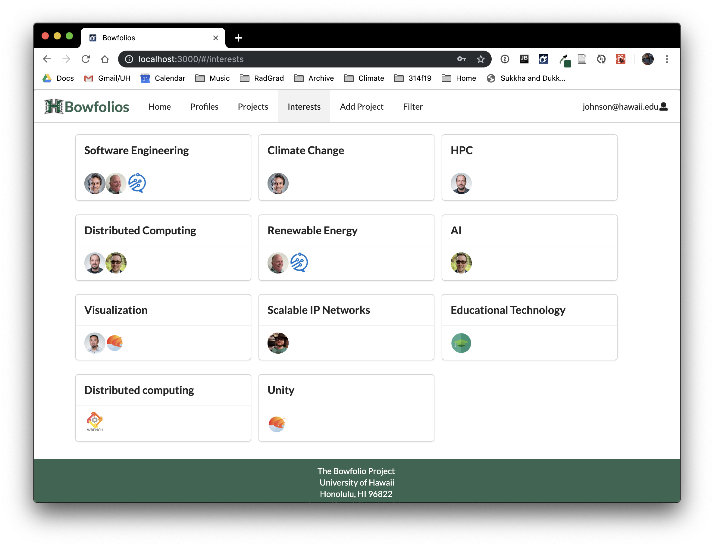

## Table of contents

* [Overview](#overview)
* [Deployment](#deployment)
* [User Guide](#user-guide)
* [Community Feedback](#community-feedback)

## Overview

BowFolios is an example web application that provides pages to view and (in some cases) modify profiles, projects, and interests. It illustrates various technologies useful to ICS software engineering students, including:

* [Meteor](https://www.meteor.com/) for Javascript-based implementation of client and server code.
* [React](https://reactjs.org/) for component-based UI implementation and routing.
* [Semantic UI React](https://react.semantic-ui.com/) CSS Framework for UI design.
* [Uniforms](https://uniforms.tools/) for React and Semantic UI-based form design and display.

It also provides code that implements a variety of useful design concepts, including:

* Three primary collections (Profiles, Projects, Interests) as well as three "join" Collections (ProfilesInterests, ProfilesProjects, and ProjectsInterests) that implement many-to-many relationships between them.
* Top-level index pages (Profiles, Interests, and Projects) that show how to manipulate these six collections in various ways.
* Initialization code to define default Profiles, Interests, and Projects and relations between them.
* A simple Filter page to illustrate how to perform simple queries on the database and display the results.
* Use of Meteor Methods to illustrate how to simplify implementation of multiple collection updates.
* Use of indexes to enforce uniqueness of certain fields in the collections, enabling them to serve as primary keys.
* Authentication using the built-in Meteor accounts package along with Sign Up and Sign In pages.
* Authorization examples: certain pages are public (Profiles, Projects, Interests), while other pages require login (AddProject, Filter).
* Use of Meteor Assets to initialize the database (helpful when initialization exceeds settings file size limits).

## Deployment

A live deployment of BowFolios is available at [https://bowfolios.org](https://bowfolios.org).

## User Guide

This section provides a walkthrough of the Bowfolios user interface and its capabilities.

### Landing Page

The landing page is presented to users when they visit the top-level URL to the site.

### Index pages (Projects, Profiles, Interests)

Bowfolios provides three public pages that present the contents of the database organized in various ways.

The Profiles page shows all the current defined profiles and their associated Projects and Interests:

The Projects page shows all of the currently defined Projects and their associated Profiles and Interests:

Finally, the Interests page shows all the currently defined Interests, and their associated Profiles and Projects:

### Sign in and sign up

Click on the "Login" button in the upper right corner of the navbar, then select "Sign in" to go to the following page and login. You must have been previously registered with the system to use this option:

Alternatively, you can select "Sign up" to go to the following page and register as a new user:

### Home page

After logging in, you are taken to the home page, which presents a form where you can complete and/or update your personal profile:

### Add Project page

Once you are logged in, you can define new projects with the Add Project page:

### Filter page

The Filter page provides the ability to query the database and display the results in the page. In this case, the query displays all of the Profiles that match one or more of the specified Interest(s).

## Community Feedback

We are interested in your experience using Bowfolio!  If you would like, please take a couple of minutes to fill out the [Bowfolios Feedback Form](https://forms.gle/hBHdccQEbm4YNfPd6). It contains only five short questions and will help us understand how to improve the system.
