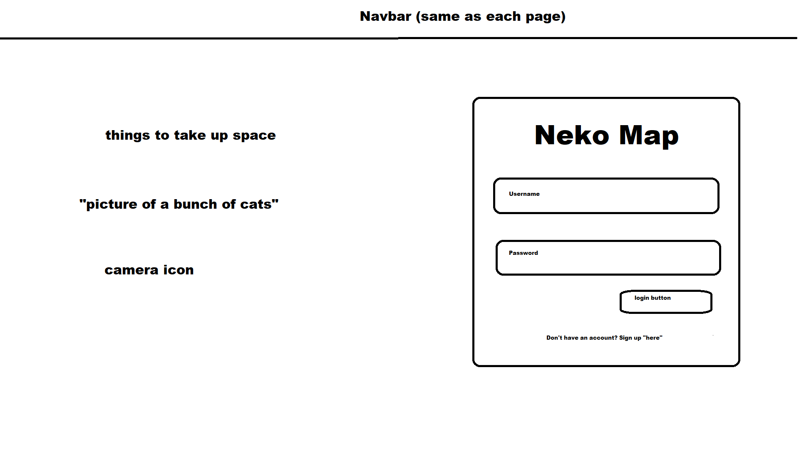

## Table of contents

* [Overview](#overview)
* [User Guide](#user-guide)

## Overview

Neko Map is an application that allows students share, track, and create profiles for stray cats on campus. Students can upload any information known about the cats they find and collaborate with other users to take care of them. The application will also implment various features to such as: 

* Cat name, gender, pictures, age, location
* Illnesses
* Feeding volunteers
* Adoption/vet pickup
* Kittens notification
* Map-based location guide
* Reports on population, illnesses, feedings, etc.
* Emergency notification info

## User Guide

This section provides a walkthrough of the Neko Map user interface and its capabilities.

### Landing Page

The landing page is presented to users when they visit the top-level URL to the site.

### Stray Cats page

Neko Map provides a public pages that present currently registered stray cats.

The Stray Cats page shows all of the currently registered stray cats and their associated Profiles:

### Cat Profile page

Cat Profile pages provide images on the stray cat, a link to a volunteer form, and a public feed to provide updates about the cat (Last seen location, new illnesses, new pictures, etc.)

### Sign in and sign up

Click on the "Login" button in the upper right corner of the navbar, then select "Sign in" to go to the following page and login. You must have been previously registered with the system to use this option:

Alternatively, you can select "Sign up" and register as a new user.

### Home page

After logging in, you are taken to the home page, which presents a form where you can complete and/or update your personal profile:

### Register New Stray page

Once you are logged in, you can petition for a new cat profile through the Register New Stray page:

### Volunteer page

If you would like to care of a stray you can sign up to on the Volunteer page:

### Deployment

[Website Link](http://143.110.153.74/#/)

[M1 Project Board](https://github.com/neko-map/neko-map/projects/2)

[M2 Project Board](https://github.com/neko-map/neko-map/projects/3)
